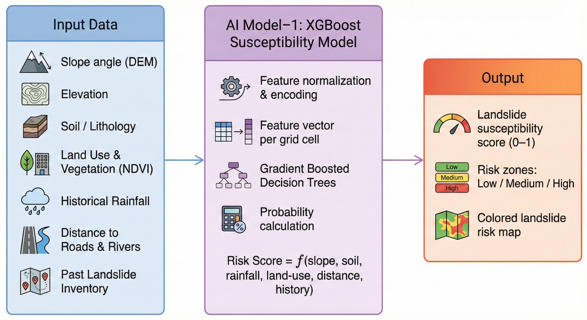
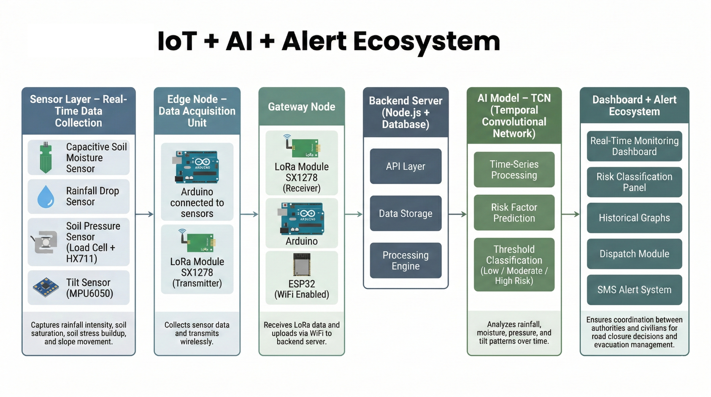
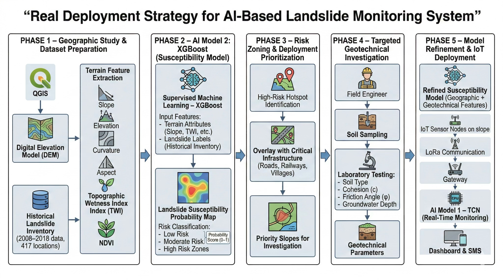
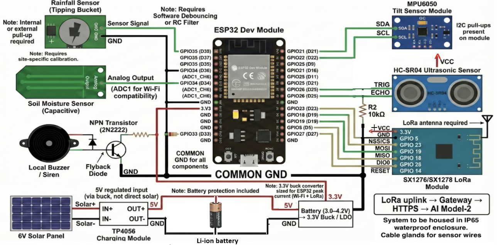

# 🌍 Landslide Monitoring & Early Warning System

> AI-Powered Real-Time Landslide Detection, Risk Prediction & Emergency Response Platform  
> 🏆 Winner — ReGen Hackathon 2.0

<p align="center">
  
  
  
  
  
  
</p>

---

# 🚨 About The Project

The **Landslide Monitoring & Early Warning System** is a real-time disaster prevention platform designed to detect, analyze, and predict landslide risks using:

- 🌧️ Environmental sensor monitoring
- 🛰️ Real-time geospatial visualization
- 🤖 AI/ML risk prediction
- 📡 Emergency alert broadcasting
- 📍 GPS & map integration
- 📲 SMS emergency notifications
- ⚡ Live Socket.io communication
- 📊 Smart disaster management dashboard

The system helps:
- Disaster response teams
- Government agencies
- Villages in landslide-prone regions
- Environmental monitoring organizations

through intelligent early-warning systems and real-time emergency coordination.

---

# 🏆 Achievement

## 🥇 Winner — ReGen Hackathon 2.0

This project was developed during **ReGen Hackathon 2.0**, where it won for its innovative AI-powered disaster prevention and monitoring ecosystem.

---

# 📸 System Architecture

## 🧠 AI-Based Landslide Susceptibility Model

<p align="center">
  
</p>

The system uses an XGBoost-based machine learning model trained on:

- Slope angle (DEM)
- Elevation
- Soil & lithology
- NDVI vegetation index
- Historical rainfall
- Distance to roads & rivers
- Historical landslide inventory

The model generates:

- 📊 Landslide susceptibility scores
- 🟢 Low risk zones
- 🟡 Medium risk zones
- 🔴 High risk zones
- 🗺️ Hazard risk maps

---

# 🌐 IoT + AI Alert Ecosystem

<p align="center">
  
</p>

The platform integrates:

- Capacitive soil moisture sensors
- Rainfall monitoring
- Soil pressure monitoring
- MPU6050 tilt sensors
- Arduino + ESP32 edge devices
- LoRa SX1278 communication
- AI-based TCN risk analysis
- Real-time alert dashboard
- SMS emergency broadcasting

---

# 🚀 Real Deployment Strategy

<p align="center">
  
</p>

The deployment pipeline includes:

1. Geographic & terrain analysis
2. AI susceptibility modeling
3. Risk zoning & prioritization
4. Geotechnical investigation
5. IoT-based real-time deployment

This creates a scalable disaster prevention infrastructure for landslide-prone regions.

---

# 🔌 Hardware Architecture & Circuit Diagram

<p align="center">
  
</p>

Hardware Components:

- ESP32 Dev Module
- LoRa SX1276/SX1278
- Capacitive Soil Moisture Sensor
- Rainfall Sensor
- MPU6050 Tilt Sensor
- HC-SR04 Ultrasonic Sensor
- Solar Power + Battery Backup
- Local Emergency Buzzer

Communication Stack:

```text
Sensors → ESP32 → LoRa → Gateway → Backend → AI Engine
```

---

# 🏗️ High-Level Project Structure

```bash
Landslide-Project/
├── client/              # React + Vite frontend
├── server/              # Express API + Socket.io
├── shared/              # Shared schemas & API routes
├── ml_service/          # Python FastAPI ML service
├── script/              # Build scripts
├── attached_assets/     # Design/reference assets
├── landslide_ai/        # Nested git repo / submodule
└── [root configs]
```

---

# 🖥️ Frontend — React + Vite

```bash
client/
├── src/pages/
│   ├── dashboard.tsx
│   ├── map.tsx
│   ├── alerts.tsx
│   ├── EmergencyBroadcastPage.tsx
│   └── DispatchPage.tsx
```

### Frontend Features

- 📊 Real-time monitoring dashboard
- 🗺️ Interactive geospatial maps
- 🚨 Emergency broadcast system
- 📱 Mobile responsive UI
- ⚡ Live Socket.io updates
- 🌈 Tailwind + shadcn UI

---

# 🔧 Backend — Express + PostgreSQL

```bash
server/
├── routes.ts
├── db.ts
├── storage.ts
├── sms.ts
└── emergencyMessage.ts
```

### Backend Features

- REST APIs
- Real-time Socket.io communication
- PostgreSQL integration
- Drizzle ORM
- Emergency SMS broadcasting
- Modular backend architecture

---

# 🤖 ML Service — FastAPI

```bash
ml_service/
├── main.py
└── requirements.txt
```

### AI/ML Features

- Landslide risk prediction
- Sensor data analysis
- Hazard classification
- Risk scoring
- AI-ready FastAPI microservice

---

# 📡 Data Flow

```text
Sensors → Express API → PostgreSQL → ML Service
        → Risk Engine → Socket.io → Dashboard Alerts
        → SMS Emergency Broadcast
```

---

# 🛠️ Tech Stack

| Category | Technologies |
|----------|--------------|
| Frontend | React, Vite, TypeScript |
| Styling | Tailwind CSS, shadcn/ui |
| Backend | Node.js, Express.js |
| Database | PostgreSQL |
| ORM | Drizzle ORM |
| Real-Time | Socket.io |
| ML Service | Python FastAPI |
| Maps | Leaflet |
| Notifications | Twilio SMS |
| Deployment | Replit / Node Hosting |

---

# 🚀 Installation & Setup

## 1️⃣ Clone Repository

```bash
git clone https://github.com/your-username/Landslide-Project.git
cd Landslide-Project
```

---

## 2️⃣ Install Dependencies

```bash
npm install
```

---

## 3️⃣ Configure Environment Variables

Create `.env` file:

```env
DATABASE_URL=your_database_url
SESSION_SECRET=your_secret
TWILIO_ACCOUNT_SID=your_sid
TWILIO_AUTH_TOKEN=your_token
```

---

## 4️⃣ Push Database Schema

```bash
npm run db:push
```

---

## 5️⃣ Start Main Application

```bash
npm run dev
```

---

## 6️⃣ Run ML Service

```bash
pip install -r ml_service/requirements.txt
python ml_service/main.py
```

ML service runs on:

```bash
http://localhost:5001
```

---

# 📦 Available Scripts

| Command | Description |
|----------|-------------|
| `npm run dev` | Start frontend + backend |
| `npm run build` | Production build |
| `npm run db:push` | Push database schema |
| `python ml_service/main.py` | Start ML service |

---

# 🌟 Core Features

| Feature | Description |
|----------|-------------|
| 📡 Real-Time Monitoring | Live environmental sensor monitoring |
| 🤖 AI Risk Prediction | ML-powered landslide detection |
| 🚨 Emergency Alerts | Instant warnings & broadcasts |
| 📍 GPS Mapping | Interactive risk visualization |
| 📲 SMS Notifications | Emergency alert system |
| ⚡ Socket.io Updates | Real-time communication |
| 🗺️ Geospatial Analysis | Risk heatmaps & terrain analysis |
| 📊 Analytics Dashboard | Disaster monitoring platform |

---

# 🔮 Future Enhancements

- 🛰️ Satellite integration
- 🌧️ Weather API integration
- 📱 Mobile application
- 🤖 Advanced deep learning models
- 📡 LoRa mesh communication
- 🌐 Multi-language support
- ☁️ Cloud-native deployment

---

# 👨‍💻 Team Members

- Malemnganba Achom
- Mayangmayum Arkib
- Yoihenba Laishram
- Ngangom Dhanajit Singh

---

# 🧪 Research & Innovation

The project combines:

- AI & Machine Learning
- IoT Sensor Networks
- Geospatial Intelligence
- Real-Time Systems
- Disaster Management
- Emergency Communication
- Predictive Analytics

to create a scalable landslide early-warning ecosystem.

---

# 📜 License

This project is developed for educational, research, and hackathon purposes.

---

# ❤️ Acknowledgements

Special thanks to:

- ReGen Hackathon 2.0
- Open-source community
- Disaster management researchers
- Environmental monitoring initiatives

---

# 🌟 Support

If you like this project:

⭐ Star this repository  
🍴 Fork the project  
📢 Share with others

---

<p align="center">
  Built with ❤️ for Disaster Prevention & Public Safety
</p>